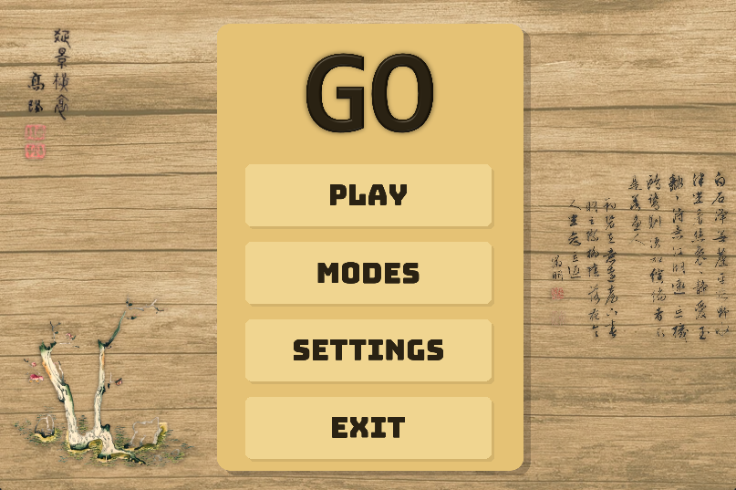
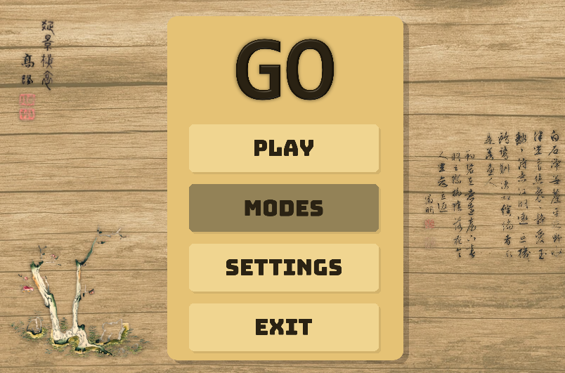
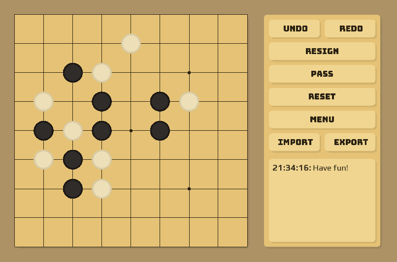
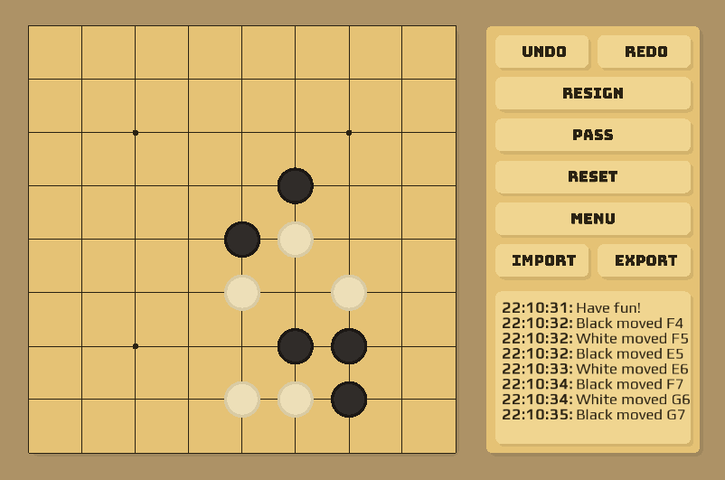
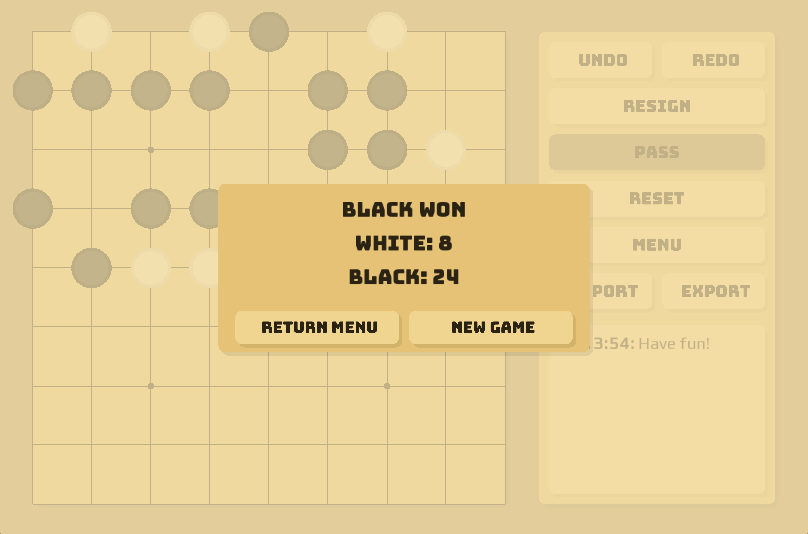

# GoGame
GoGame is an application that allows users to play the classic board game **Go**. It provides a simple and interactive interface to enjoy the game without requiring an internet connection.

## Table of contents

- [Features](#features)
- [Installation](#installation)
- [Setup and Run](#setup-and-run)
- [Usage](#usage)
- [Rule](#rules)
- [Contributing](#contributing)
- [License](#license)


## Features

- Play Go offline with another player on the same device.

- Interactive and userfriendly-interface.

- Select visual themes for the board.

- Allow user to export and import the board to save or load the games.

- Enable or disable sound effects and background music.

- Implement standard Go rules with three different board size:
    - 9x9
    - 13x13
    - 19x19
- Undo and redo operations.
- Reset, resign, pass are allowed in a game
- Play against the computer with different difficulty level:
    - Easy
    - Medium
    - Hard


## Installation
**MinGW** version 10.0 or later
[Download MinGW-w64](https://www.mingw-w64.org/downloads/)

**Make** (for Makefile)
[Download Make for windows](https://gnuwin32.sourceforge.net/packages/make.htm)


## Setup and Run
1. Download the project
    -Clone the repository
    ```bash
    git clone https://github.com/yourusername/go-game.git
    ```
    Or download the ZIP from Github
    - Go to the repository page on Github    
    - Click **Code** **→** **Download ZIP**
    - Extract the ZIP into a folder
2. **Build the project** 
    - Open Command Prompt in the project folder
    ```bash
    make
    ```
3. **Run the project** 
    ```bash
    .\main.exe
    ```
4. **Clean build files (optional)**
    ```bash
    make clean
    ```
## Usage
This game is controlled entirely with the mouse.

To start the game it take about 5-6 seconds for setting up.

**ORIGINAL STATE**


There are four options: 
- **Play**: Launch a new match with current settings
- **Modes**: Configure match setup, including Board Size and Opponent Type(PvP or AI)
- **Settings**: Customize application preferences such as visual themes and audio
- **Exit**: Close the application

To choose the options you can click directly to the button. It also has a hover effects to indicate which option is being selected.



**GAME STATE**

The board visual has many button support for:
- **UNDO/REDO**: Revert the last move or re-apply a move (useful for correcting mistakes).
- **RESIGN**: Concede the match. The resigning player loses immediately.
- **PASS**: Skip your current turn.
- **RESET**: Clear the board and restart the current match from the beginning without score reaveling.
- **MENU**: Return to the main menu.
- **IMPORT/EXPORT**: Save the current game progress to a file or load a saved file.
- **GAME LOG**: Located [at the bottom/on the side] of the screen, the Game Log displays a chronological history of all match, including:

    - "Pass" actions
    - Game notifications(e.g, "Game loaded", "Game saved", "Moves played", etc)


**END GAME SCORING**
- Display Black and White points.
- Notifies who won and the reason.
- Scoring is calculated according to the rules specifies below.



## Rules

Since there are many sets of rules available for the board game Go, we have decided to use these two references for the rules:

Reference 1: [Click here](https://www.cs.cmu.edu/~wjh/go/rules/Chinese.html)

Reference 2: [Click here](https://vnchess.com.vn/luat-choi-co-vay-co-ban/)

And recompile them into a single rule list as follows:
- The board is a square grid of either 9, 13, or 19 points marked on each side. Each intersection between the gridlines can either be empty (also called liberty), has a black stone, or a white stone. Note that stone and piece are equivalent terms and will be used interchangably throughout.
- The black stones are controlled by Black, the white stoned are controlled by White.
- At each player’s turn, they can choose to:
+ Place a single stone in any empty intersections (as long as the placement doesn’t violate the special rules set below).
+ Skip the turn (not placing any stones).
- The turns alternate between Black and White, with Black making the first move.
- When a group of connected stones of the same colour isn’t adjacent to any liberties, it gets captured by the opposing side.
- Special rules:
	+ If a move doesn’t cause the capture any of the opponent’s stones, but stones of its own colour to be captures, that move is illegal.
	+ If a move causes the board to reach the same state it did at your last turn, that move is illegal.
- The game ends when both players skip moves consecutively, or one person resigns.
- If one person resigns, they loses regardless.
- Otherwise, each player’s score will be tallied up and the person with higher score wins. In the case the scores are equal, White wins.

## Contributing

This application developed by two members:

- Nguyen Phu Trong
- Nguyen Dang Khang

We work together to develop this Go Game application as part of a university project.

## License
This project is for **educational purposes only** and is not intended for commercial use.
